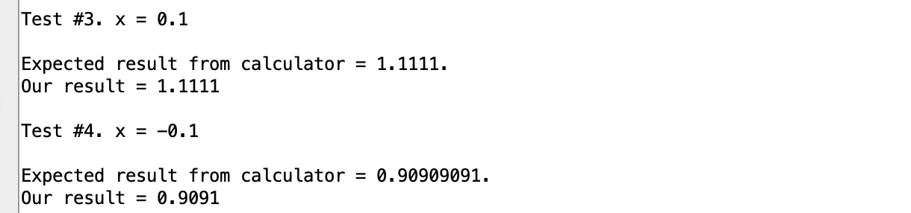
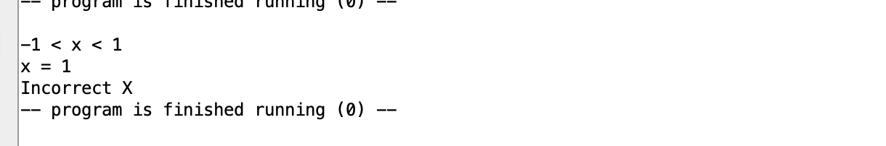
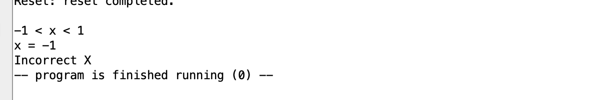
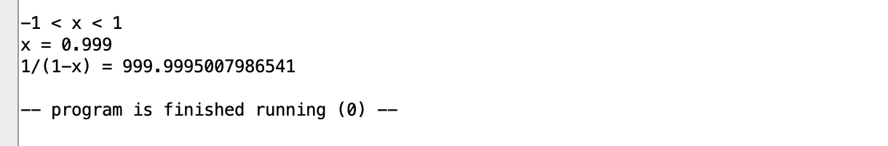
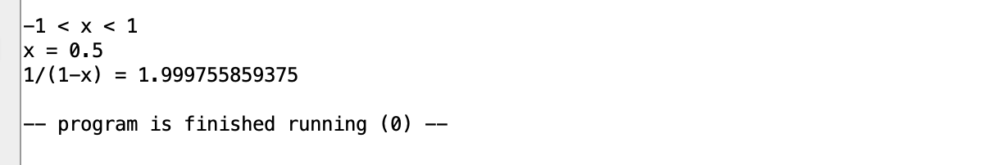
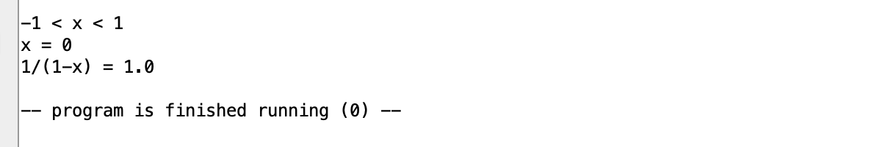
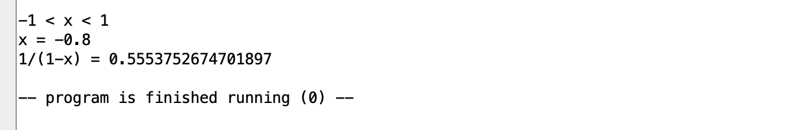

• Прозорский Михаил Алексеевич

• БПИ224

• 11 вариант

• Разработать программу, вычисляющую с помощью степенного ряда с точностью не хуже 0,05% значение функции 1/(1-x) для заданного параметра x.

• Тестовая программа находится в папке "test", а основная в папке "main"

• Для решения использовал http://mathprofi.ru/razlozhenie_funkcij_v_stepennye_ryady.html и 

• Из разложения функции 1/(1+x) я вывел разложение для 1/(1-x):

• Далее, так как мой ряд знакопостоянный, мне потребовалось найти условия прекращения цикла в зависимости от точности:

• Второе условие - если полученная сумма меньше точности

• Алгоритм:

1. Инициализируем переменные: текущий результат current_result и текущий член ряда current_value устанавливаются в 1.
2. Далее, мы используем цикл, который выполняется до тех пор, пока текущий член ряда current_value не станет меньше заданной точности precision и не выполнится описанное выше второе условие.
3. На каждом шаге цикла мы увеличиваем переменную current_value, домножая её на x. После чего увеличиваем на неё значение переменной current_result.
4. После завершения цикла, у нас есть приближенное значение функции 1/(1-x) с заданной точностью.

• Результат тестовой программы:

• Результат тестов основной программы:

